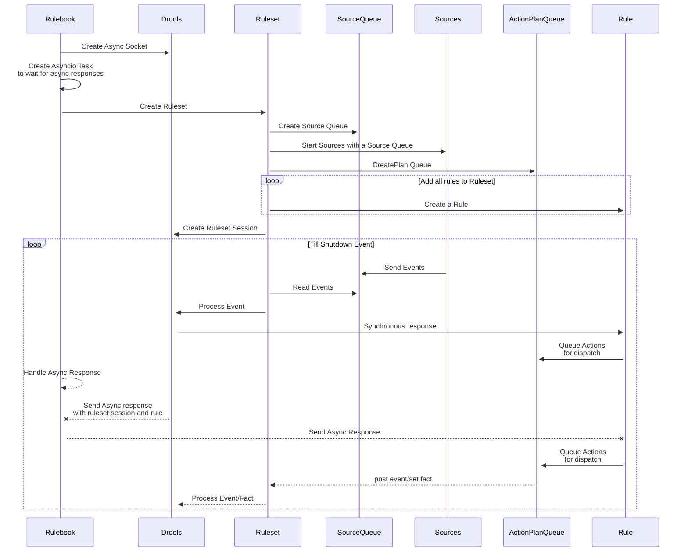

```mermaid
sequenceDiagram
    Rulebook->>+Drools: Create Async Socket
    Rulebook->>+Rulebook:Create Asyncio Task <br/> to wait for async responses
    Rulebook->>+Ruleset: Create Ruleset
    Ruleset->>+SourceQueue: Create Source Queue
    Ruleset->>+Sources: Start Sources with a Source Queue
    Ruleset->>+ActionPlanQueue: CreatePlan Queue
    Loop Add all rules to Ruleset
    Ruleset->>+Rule: Create a Rule
    end
    Ruleset->>+Drools: Create Ruleset Session
    Loop Till Shutdown Event
    Sources->>+SourceQueue: Send Events
    Ruleset->>+SourceQueue: Read Events
    Ruleset->>+Drools: Process Event
    Drools->>+Rule: Synchronous response
    Rule->>+ActionPlanQueue: Queue Actions <br/> for dispatch
    Rulebook-->>+Rulebook: Handle Async Response
    Drools--X+Rulebook: Send Async response<br/>with ruleset session and rule
    Rulebook--X+Rule: Send Async Response
    Rule->>+ActionPlanQueue: Queue Actions <br/> for dispatch
    ActionPlanQueue-->>+Ruleset: post event/set fact
    Ruleset-->>+Drools: Process Event/Fact
    end
```    
